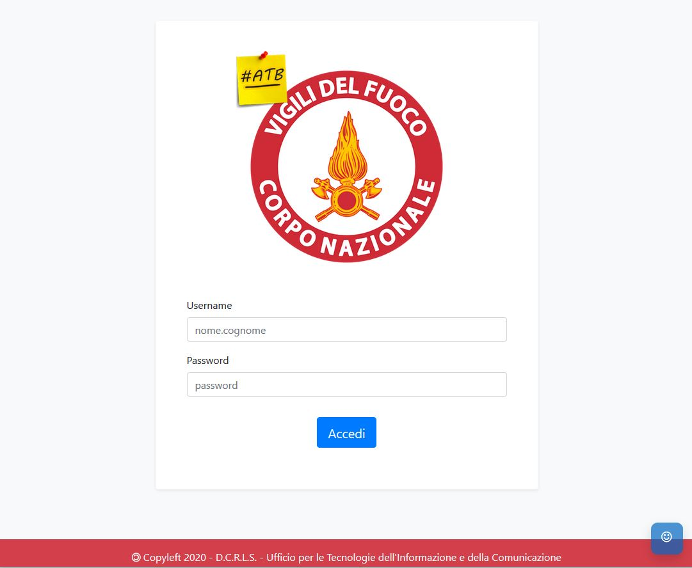
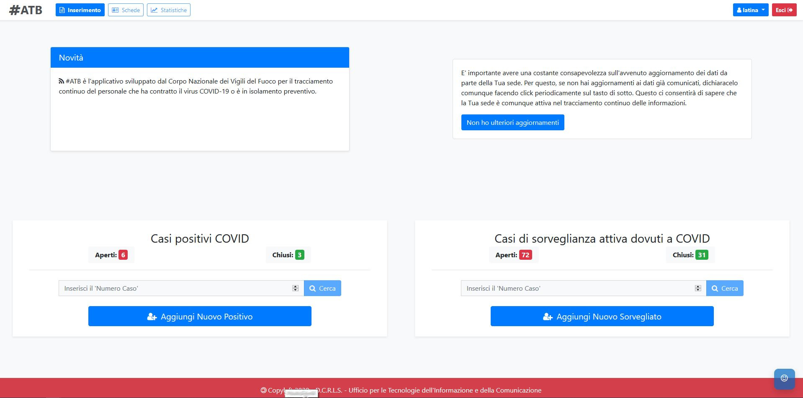
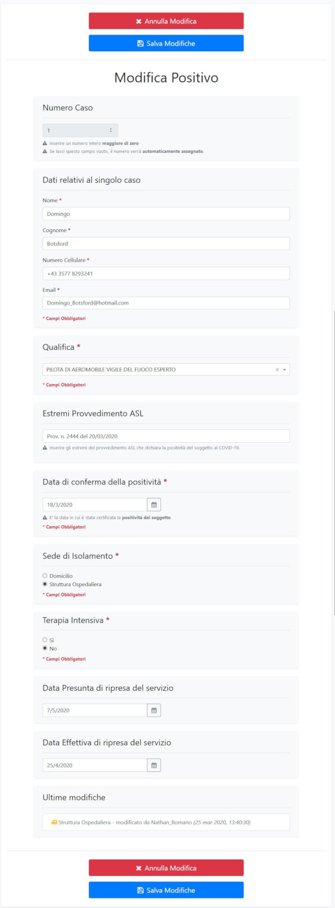
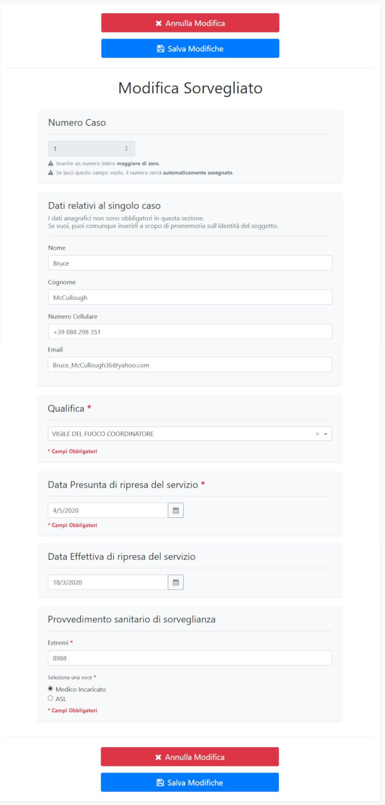
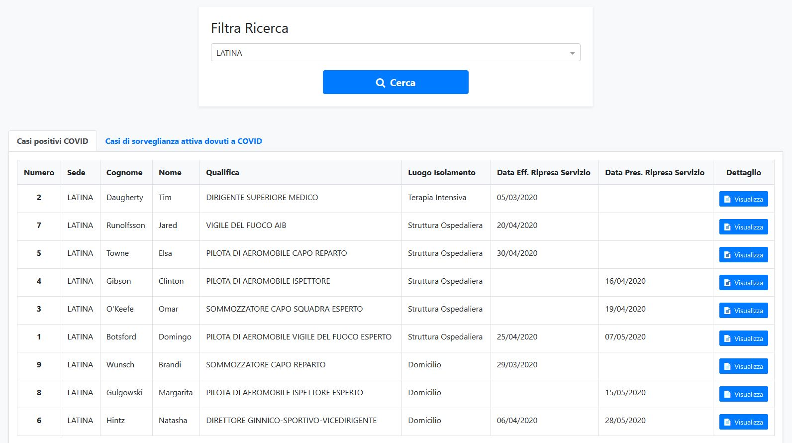
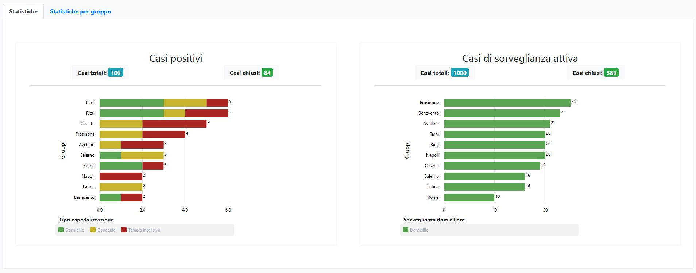
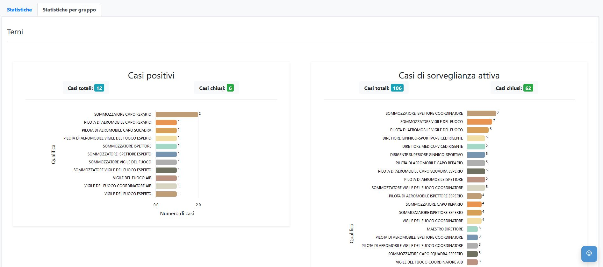
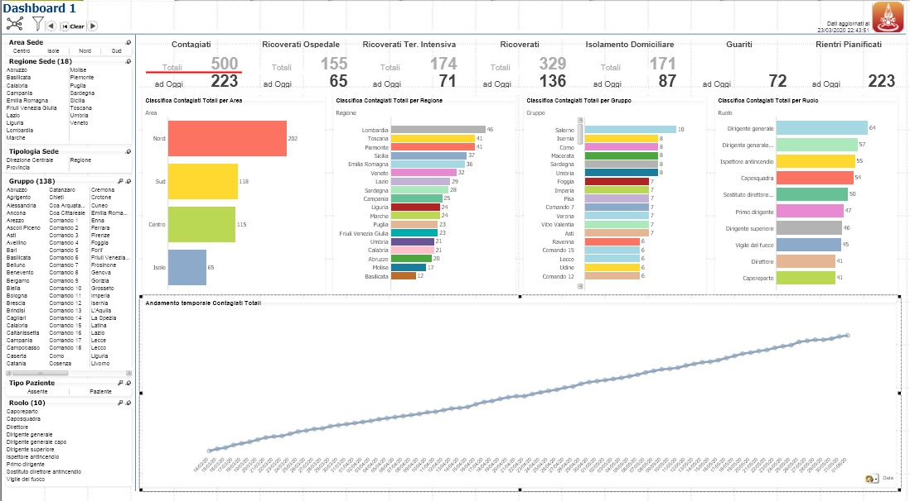
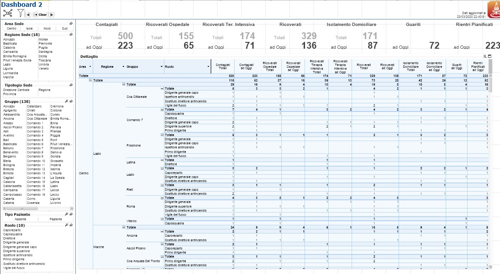

# #ATB

#ATB è l'applicativo sviluppato dal Corpo Nazionale dei Vigili del Fuoco per il tracciamento continuo del personale che ha contratto il virus COVID-19 o è in isolamento preventivo.

#ATB is developed by the Italian Fire Corps and allows to track COVID-19 patients and suspect employees subject to home isolation as a precautionary measure.

## Screenshots

## Software architecture

Il software è costituito da:

* un modulo frontend sviluppato in Angular9;
* un modulo backend sviluppato in WebApi netcore 3.1;
* un database basato su MongoDB community edition.

## Technical documents

* [REST interface](rest-interface.md)
* [DB schema](db-schema.md)